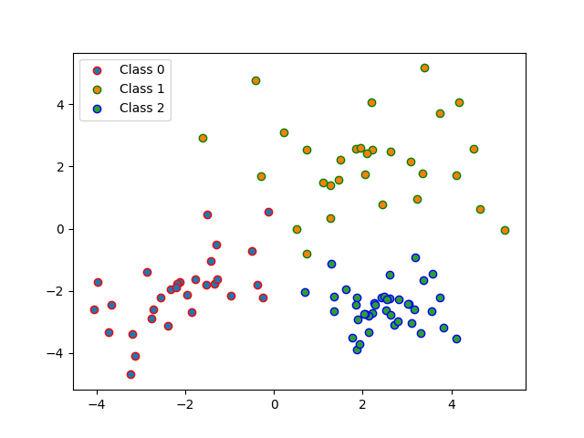
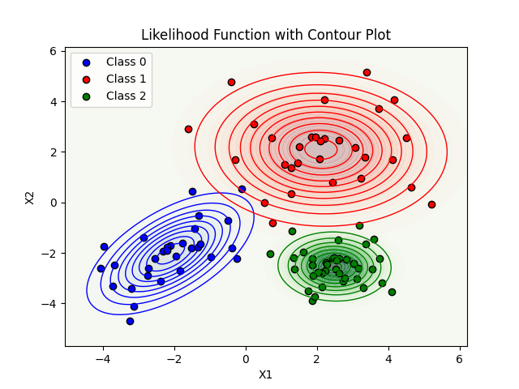
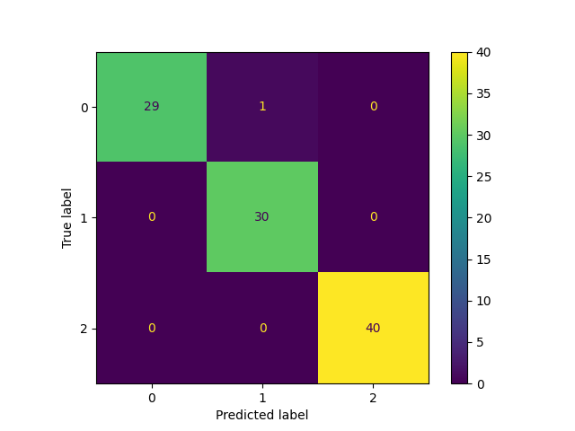
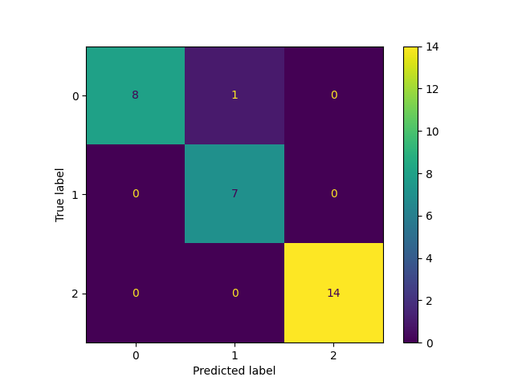
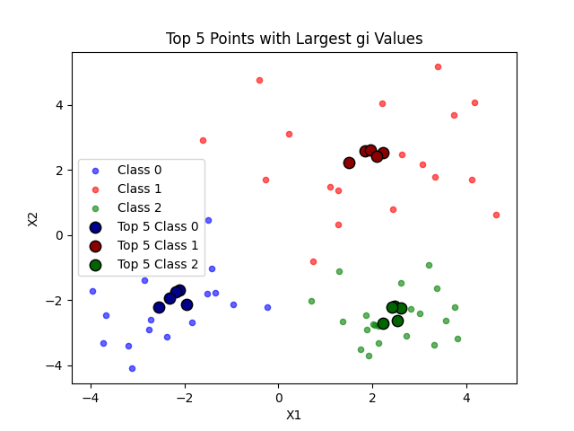

# Classification and Bayesian Analysis

## Project Overview

This project involved classifying data points into three different classes using a Bayesian classifier. The tasks included generating scatter plots, estimating prior probabilities and likelihood distributions, classifying data, and evaluating the classifier's performance. Below is a summary of the completed tasks along with results and visualizations.

## Setup

The project was set up using a Python virtual environment with the necessary libraries installed via a `requirements.txt` file. The required libraries were:

- `scipy`
- `numpy`
- `pandas`
- `matplotlib`
- `scikit-learn`

### Environment Setup

1. **Created a Python Virtual Environment**

    ```bash
    python -m venv env
    ```

2. **Activated the Virtual Environment**

    - **On Windows:**

        ```bash
        .\env\Scripts\activate
        ```

    - **On macOS/Linux:**

        ```bash
        source env/bin/activate
        ```

3. **Installed Required Libraries**

    ```bash
    pip install -r requirements.txt
    ```

## Data Files

The following data files were used:

- `data.csv`
- `train.npz`
- `test.npz`

All files were stored in the same directory as the Python script.

## Steps Completed

### 1: Scatter Plot

- **Generated a Scatter Plot**:
    - Plotted all data points from `data.csv` in a 2D plane `(x1, x2)`.
    - Used distinct colors for different classes.

    

### 2: Estimate Prior Probabilities

- **Calculated Prior Probabilities**:
    - Estimated the frequency of each class and computed:
      ```
      P(C0) = 0.3000
      P(C1) = 0.3000
      P(C2) = 0.4000
      ```
    - Probabilities were printed.

### 3: Estimate Likelihood Distributions

- **Calculated Mean and Covariance**:
    - Estimated the mean vector and covariance matrix for each class using `numpy`.
    - Results were printed as follows:
      ```
        Mean of Category 0: [-2.1059717  -2.03269825]
        Covariance of Category 0: 
        [[1.21297301 0.75301087]
        [0.75301087 1.28301366]]
        Mean of Category 1: [2.11322354 2.10362432]
        Covariance of Category 1: 
        [[ 2.66800561 -0.08087598]
        [-0.08087598  1.97992985]]
        Mean of Category 2: [ 2.49371806 -2.53691137]
        Covariance of Category 2: 
        [[ 0.59420363 -0.01723699]
        [-0.01723699  0.44355511]]
      ```

- **Estimated Likelihood Distribution**:
    - Used `scipy.stats.multivariate_normal` to estimate `P(x|Ci)` for each class.

    

### 4: Classification

- **Classified Data Points**:
    - Applied the Bayesian likelihood distribution to classify all data points.
    -  Generated and printed the confusion matrix.
      
- **Classified with Train and Test Data**:
    - Used `train.npz` for training and `test.npz` for evaluating the model.
      
    - Repeated classification and performance evaluation using these datasets.

    - **Train Data Accuracy**: `99.00%`
      
    - **Test Data Accuracy**: `96.67%`

- **Confusion Matrix for Training Data** (True vs. Predicted Labels):

    

- **Confusion Matrix for Testing Data** (True vs. Predicted Labels):

    


### 5: Largest Data Points

- **Top 5 Data Points**:
    - Identified and printed the top 5 data points with the highest `gi` values for each class.

    ```
    ----- Largest five points in class 0 -----
    [[-2.1159091  -1.7053106 ]
    [-2.18975941 -1.76142754]
    [-1.94603611 -2.13321996]
    [-2.32326967 -1.94510715]
    [-2.551234   -2.21755967]]
    ----- Largest five points in class 1 -----
    [[1.50797792 2.22111083]
    [2.21912875 2.53480256]
    [1.8540265  2.58067397]
    [1.96014431 2.60575274]
    [2.09406956 2.42775986]]
    ----- Largest five points in class 2 -----
    [[ 2.48007216 -2.19712363]
    [ 2.60956438 -2.23259872]
    [ 2.42701325 -2.20966301]
    [ 2.22611858 -2.71376032]
    [ 2.53235616 -2.63235897]]
    ```

- **Generated Discrimination Plot**:
    - Plotted the Bayesian discriminative function `gi` for each class.
    - Saved the plot with labeled axes as `X1` and `X2`.

    

## Conclusion

The project successfully classified data points into three classes using Bayesian analysis. The results were visualized and evaluated to ensure the accuracy and effectiveness of the classification. The classifier performed exceptionally well on both the training and testing datasets, achieving an accuracy of 99.00% on the training set and 96.67% on the test set.
